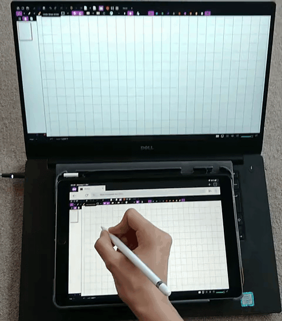

# Rylus

> Use a tablet or phone as a browser-based drawing surface, touch controller,
> and screen viewer for your computer.



[Quick start](#quick-start-build-and-run) · [Platform support](#what-it-supports) · [Security](#security-and-network-posture) · [Development](#development) · [License](#lineage-attribution-and-licensing)

Rylus serves a small web client from your computer. Open it on a device on the
same network to view a captured display or window and relay pointer, pen,
touch, and physical-keyboard input back to the host. There is nothing to
install on the client device beyond a browser that supports the required web
platform features.

Rylus is intended for a trusted local network, not for exposing desktop
control to the public internet. Read [Security and network posture](#security-and-network-posture)
before starting it on a shared network.

## At a glance

- Browser client for a tablet or phone; no companion app.
- Display streaming over HTTP(S) and WebSocket on one configurable port
  (default `1701`).
- Pointer Events carry pen pressure, tilt, touch, mouse, wheel, and physical
  keyboard input where the browser and host backend support them.
- Native capture and input backends for Linux, macOS, and Windows.
- An all-Rust workspace for Rylus-owned code, with FFmpeg used for H.264/fMP4
  video encoding.
- Optional TLS, access-code authentication, browser-origin checks, rate
  limiting, and mDNS discovery.

## Quick start: build and run

The current repository is the authoritative distribution source. Tagged CI
workflows can produce platform artifacts, but their publication location and
availability are not guaranteed by this README.

### 1. Install build prerequisites

Rylus currently requires Rust **1.88+**, Node.js/npm (to bundle the web
client), and FFmpeg development libraries. Linux also needs the platform
libraries for PipeWire/portals and input/capture support. The supplied
[Dockerfile](docker/Dockerfile) and [Alpine Dockerfile](docker/Dockerfile_alpine)
are the maintained dependency references.

For Debian/Ubuntu, this is a practical starting point:

```sh
sudo apt-get install -y \
  build-essential clang cmake git pkg-config nasm nodejs npm libssl-dev \
  libgl1-mesa-dev libglu1-mesa-dev \
  libpipewire-0.3-dev libdbus-1-dev libdrm-dev libva-dev \
  libwayland-dev libxkbcommon-dev \
  libavcodec-dev libavformat-dev libavfilter-dev libavutil-dev \
  libswscale-dev libswresample-dev
```

Install Rust through your platform’s preferred method, then verify the
toolchain with `rustc --version`.

### 2. Build

```sh
npm ci
cargo build --release --locked -p rylus-server
```

The executable is `target/release/rylus` (or `rylus.exe` on Windows).

On Linux/X11, X11 capture is an explicit Cargo feature rather than part of the
default build:

```sh
cargo build --release --locked -p rylus-server --features x11
```

### 3. Start the server

```sh
./target/release/rylus --no-gui --access-code 'choose-a-long-code'
```

`--no-gui` starts immediately. Without it, the native GUI lets you choose
settings and start the server. Rylus binds to `0.0.0.0:1701` by default and
advertises itself with mDNS unless `--no-mdns` is supplied.

Open `https://<host-address>:1701` on the tablet, accept the first-run
certificate warning if you use the default TLS mode, then choose a capture
source and input options in the web client. The WebSocket endpoint is `/ws` on
the same port; there is no second port to open.

For the complete option set, use:

```sh
./target/release/rylus --help
```

## What it supports

| Host platform | Capture | Input and codec options | Important limits |
| --- | --- | --- | --- |
| Linux on X11 | Displays and X11 windows when built with `--features x11` | `uinput` can expose mouse, pen, and touch; VA-API and NVENC are opt-in | Pen/touch require access to `/dev/uinput`; X11 capture is not part of the default build. |
| Linux on Wayland | PipeWire through `xdg-desktop-portal` | `uinput`; VA-API and NVENC are opt-in | The portal/compositor determines what can be shared. Per-window input mapping and cursor capture are not available. |
| macOS | CoreGraphics displays and windows | Generic input backend; VideoToolbox is opt-in | macOS permission prompts are required for screen recording and desktop control. |
| Windows | Desktop displays | Windows synthetic pen/touch input; NVENC and Media Foundation are opt-in | Per-window capture is not implemented. |

Hardware encoding is disabled by default. Enable it only after checking image
quality and stability on the specific host and driver:

```sh
# Linux examples
./target/release/rylus --no-gui --try-vaapi
./target/release/rylus --no-gui --try-nvenc
```

macOS accepts `--try-videotoolbox`; Windows accepts `--try-nvenc` and
`--try-mediafoundation`. These switches request a backend; they do not make an
unsupported driver or GPU usable.

### Browser and device notes

Rylus depends on browser Pointer Events and Media Source Extensions. Pen
pressure and tilt are available only when the client browser and stylus expose
them. A physical keyboard paired with the client device can be relayed; an
on-screen keyboard is not supported. Add the site to the device’s home screen
or use the client’s fullscreen control for a more app-like canvas.

Browser support is necessarily device- and browser-version-specific. Test the
actual tablet/browser combination you plan to use, especially on iOS/iPadOS
where browser engines and certificate handling can impose additional limits.

## Security and network posture

Rylus can capture a desktop and inject input. Treat a running instance as a
privileged LAN service.

- **Keep it local.** The default bind address is `0.0.0.0`, so local-network
  peers can reach it. Do not port-forward it or place it directly on the public
  internet. Use a host firewall to limit access to trusted devices.
- **Set an access code.** When configured, Rylus stores an Argon2id hash,
  uses session cookies, and rate-limits failed authentication attempts. An
  access code complements—rather than replaces—a trusted network boundary.
- **Keep TLS enabled.** `auto` is the default mode: Rylus generates and stores
  a self-signed certificate for the current user. The first browser visit will
  need an explicit trust decision. If automatic TLS setup fails, the server
  falls back to plaintext and logs a warning; do not ignore it.
- **Use a real certificate when appropriate.** `certified` uses the supplied
  certificate and key paths; it does not obtain a certificate for you. If
  either path is absent, this version generates a self-signed pair at those
  paths instead.

```sh
# Default: self-signed TLS, stored under the user state/config directory.
./target/release/rylus --no-gui --access-code 'choose-a-long-code'

# Supply a certificate and private key you manage.
./target/release/rylus --no-gui \
  --tls-mode certified \
  --tls-cert-path /path/to/cert.der \
  --tls-key-path /path/to/key.der

# Only for a fully trusted network or a correctly configured TLS terminator.
./target/release/rylus --no-gui --tls-mode disabled
```

`disabled`, `off`, and `none` all disable TLS. In that mode, access codes and
input events travel in cleartext. mDNS is convenience discovery, not access
control; disable it with `--no-mdns` if it is unsuitable for your network.

The implementation details and known trade-offs—including origin checks that
do not constrain non-browser clients—are documented in the
[security review](docs/SECURITY-REVIEW.md). Security issues should follow the
[security policy](SECURITY.md).

### Linux `uinput` permissions

Linux pen and multi-touch injection uses the kernel’s `uinput` interface.
Giving a user access to `/dev/uinput` lets that user synthesize system-wide
input, including while another user is logged in. Do not grant that access to
untrusted accounts.

```sh
sudo groupadd -r uinput
sudo usermod -aG uinput "$USER"
echo 'KERNEL=="uinput", MODE="0660", GROUP="uinput", OPTIONS+="static_node=uinput"' \
  | sudo tee /etc/udev/rules.d/60-rylus.rules
sudo udevadm control --reload
sudo udevadm trigger
```

Log out and back in (or reboot) after changing group membership. To remove the
rule later, delete `/etc/udev/rules.d/60-rylus.rules` and reload udev. The
short version is also available in [docs/uinput.md](docs/uinput.md).

## Operations and troubleshooting

### Firewall and address

Allow TCP port `1701` (or your chosen `--web-port`) between the client device
and host. For example, with UFW:

```sh
sudo ufw allow 1701/tcp
```

If the client cannot connect, confirm that the devices have IP reachability,
the firewall permits the selected TCP port, and the URL uses `https://` when
TLS is active. With an automatically generated certificate, visit the Rylus
URL directly and complete the browser’s certificate prompt before expecting a
WebSocket connection to succeed.

### Wayland

Install PipeWire, `xdg-desktop-portal`, and the portal backend appropriate to
your desktop environment. The portal shares the capture source you approve;
Rylus cannot bypass those compositor permissions. The Wayland-specific limits
are listed in the platform table above.

### Optional second display

Rylus can mirror a display without any virtual-display configuration. If you
want the tablet to represent an additional desktop, create a virtual output in
your display stack or attach a hardware dummy plug, configure it as an
ordinary display, then select it as the capture source. Virtual-output support
is environment-specific and can destabilize a graphics session; use your
desktop environment’s documentation and keep a recovery path available.

### Headless health check

The built-in self-test uses a synthetic capture source, encodes one software
H.264 frame, opens a loopback WebSocket, and exits with status `0` or `1`.
It does not verify a real display, GPU encoder, portal, or input device.

```sh
./target/release/rylus --self-test
```

For opt-in per-frame server-side capture→encode→send timing, use
`--latency-log` and read [docs/LATENCY.md](docs/LATENCY.md). It is not an
end-to-end pointer-to-photon measurement.

## Architecture

The browser sends control data over WebSocket and receives fragmented-MP4 H.264
video for Media Source Extensions playback. The native server selects a capture
backend, encodes frames with FFmpeg, and maps browser input into the host’s
native input APIs. The wire format and compatibility rules are in
[docs/PROTOCOL.md](docs/PROTOCOL.md); the component boundaries are in
[docs/ARCHITECTURE.md](docs/ARCHITECTURE.md).

Rylus is organized as a Cargo workspace:

| Crate | Responsibility |
| --- | --- |
| `rylus-core` | Configuration, protocol, errors, pixels, shared interfaces |
| `rylus-capture` | X11, PipeWire, CoreGraphics, and Windows capture backends |
| `rylus-encode` | FFmpeg-based H.264/fMP4 encoding |
| `rylus-input` | Linux `uinput`, generic, and Windows input backends |
| `rylus-transport` | WebSocket transport |
| `rylus-gui` | Native egui/eframe interface |
| `rylus-server` | HTTP(S), sessions, TLS, mDNS, and the `rylus` binary |

## Development

```sh
npm ci
npm test
cargo test --workspace --locked
cargo fmt -- --check
cargo clippy --all-targets -- -D warnings
cargo run -q -p rylus-server -- --self-test
```

`npm run a11y` runs the browser accessibility checks and requires the
Playwright Chromium browser to be installed. See
[CONTRIBUTING.md](CONTRIBUTING.md), [ROADMAP.md](ROADMAP.md), and the
[architecture decision records](docs/adr/README.md) for project direction and
contribution context.

## Lineage, attribution, and licensing

Rylus is a substantial derivative of [Weylus](https://github.com/H-M-H/Weylus)
by H-M-H. Weylus established the browser-Pointer-Events model and native
capture/input server on which Rylus builds. Rylus has since been reorganized as
a Rust workspace and uses distinct capture, GUI, transport, and security
implementations, but it does not erase its upstream origin or attribution.

The program as a whole is licensed under the
[GNU Affero General Public License, version 3 or later](LICENSE). The
repository also preserves a mixed-license history: contributions identified in
[CONTRIBUTORS](CONTRIBUTORS) are available under the 3-Clause BSD License, as
specified by the repository’s license notice. Keep both the upstream notices
and the applicable license terms when redistributing or modifying Rylus.

Rylus is provided without warranty. See [LICENSE](LICENSE) for the complete
terms.
